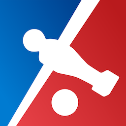

# React Table Soccer
> Web app for tracking your table soccer games



*Table Soccer aka foosball, Table Football or in german Tischkicker or Tischfußball*.


## Getting Started

### Firebase setup
Create a new project: https://console.firebase.google.com/. You need following firebase products:

1. Database: Enable the Firebase database and create following entries in the data tab:

```js
{
  data: {
    players: [],
    games: []
  }
} 
```
You also need some database rules:
```json
{
  "rules": {
    "data": {
      ".read": true,
      "games": {
      ".write": true
      },
      "players": {
        ".write": true
      }
    }
  }
}
```
Authentication: Enable the method `Google`.

Enable Hosting in your firebase console.

### Project setup

```sh
git clone git@github.com:julienthoma/table-soccer.git
```
```sh
npm install
```

Create a `.firebaserc` file in your project root.
```json
{
  "projects": {
    "stage": "tablesoccer-dev"
  }
}
```


Create configs files for development and live environment and fill them with your firebase credentials. You can use the same config for development and production, but I would create an second firebase project for production.

```sh
cp config.dist.json config.json
cp config.dist.json config-dev.json
```
```json
{
  "slackUrl": "Url for Slack webhook",
  "firebaseConfig": {
    "apiKey": "",
    "authDomain": "",
    "databaseURL": "",
    "projectId": ""
  },
  "dbUrl": "firebase dbUrl e.g. <databaseURL>/data.json",
  "slackBotUrl": "Url for slack bot"
}
```

### Development
To start the webpack dev server:
```sh
npm run dev
```

### Deployment
```sh
npm run prod
```

```sh
firebase deploy
```

### Slack webhook
Getting started: `https://api.slack.com/incoming-webhooks`.
You will get game results posted in your favorite slack channel.

### Slack Bot
For creating games from Slack you need to setup another project: `https://github.com/ioiooi/kickerbot`.

## Feature Overview

### Creating Games
- Google Login
- 2on2 Mode
- Time tracking
- Tracking goals from all positions
- Own goals
- Undo feature


### Game History
- Timeline of games
- Tracking of win streaks
- MMR based on chess ELO-Rating


### Statistics and metrics

- MMR development
- metrics for each position
- Best player for each metric


- Compare with other players


### Slack Integration

- Slack integration via web hook
- Post your games live in any channel


## Built With

- React - <https://reactjs.org/>
- Redux - <https://redux.js.org/>
- Material UI - <https://material-ui.com/>
- ChartJs - <https://www.chartjs.org/>
- Webpack - <https://webpack.js.org/>
- Firebase - <https://firebase.google.com/>

## Feedback

Feel free to report bugs or request new features on [Github](https://github.com/julienthoma/table-soccer/issues).
